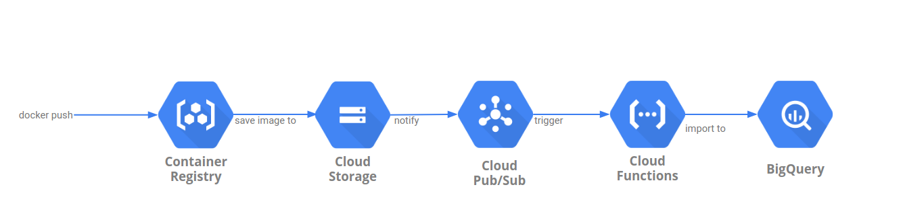
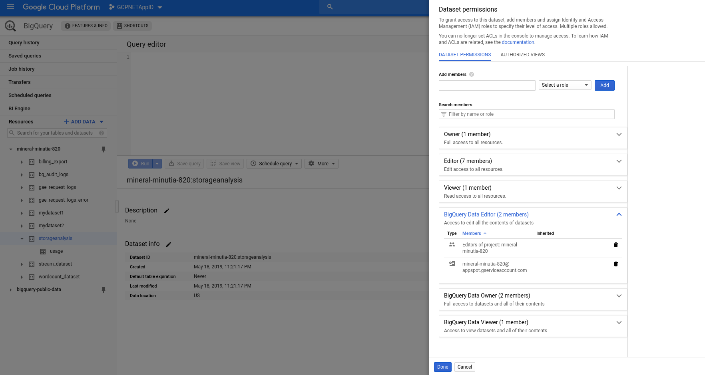
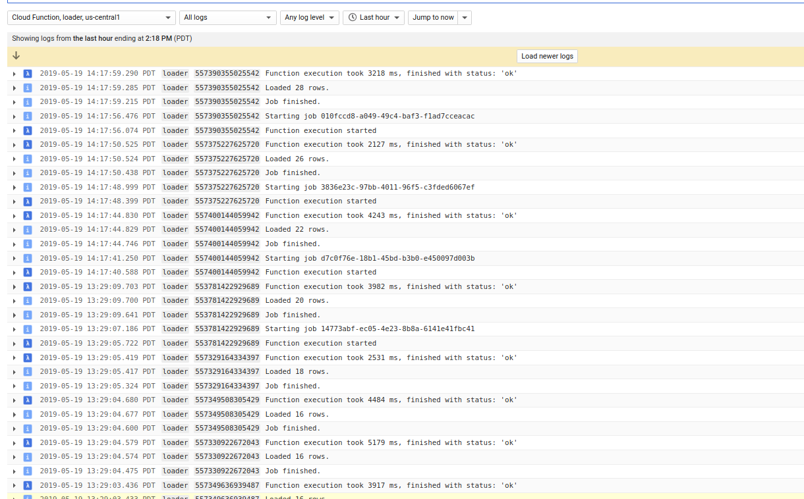
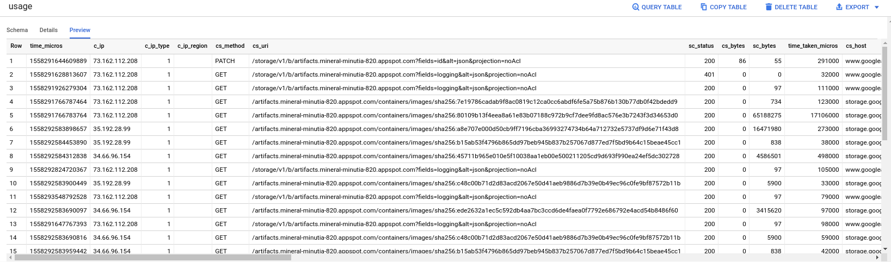

# Google Container Registry statistics from GCS access_logs

Sample flow to extract [Google Container Registry](https://cloud.google.com/container-registry/docs/) usage statistics (image push/pull counts,  analytics, etc).  GCR images are hosted on [Google Cloud Storage](https://cloud.google.com/storage/) which does have the ability to export usage which means we can indirectly acquire GCR's usage.  

There are several step sto getting the following pipeline to work but in is basic form, we setup GCS bucket used by GCR to export its usage stats to another GCS bucket.  We then setup that target bucket to automatically trigger a [Cloud Function](https://cloud.google.com/functions/docs/) everytime a new usage file is created..  The Cloud Function that is invoked will then instruct BigQuery to load the usage file directly usign its own internal GCS->BQ load functions. You will then have the GCR usage stats available in bigquery automatically.  The GCS usage statistics are exported hourly and since the pipeline is triggered automatically, your data lags by about an hour.





### GCS

First setup [GCS Access Logs](https://cloud.google.com/storage/docs/access-logs) for the bucket used by GCR.

The default Container Registry bucket URL will be listed as `gs://artifacts.[PROJECT-ID].appspot.com` or `gs://[REGION].artifacts.[PROJECT-ID].appspot.com`.
```

"When you push an image to a registry with a new hostname, Container Registry creates a storage bucket in the specified multi-regional location. This bucket is the underlying storage for the registry. This location is not your location, but the location where the images is stored.."
```

- First setup another bucket where you want to export the access logs on GCR's bucket:

```bash
export GOOGLE_PROJECT_ID=`gcloud config get-value core/project`
gsutil mb gs://$GOOGLE_PROJECT_ID-gcr-logs/
```

- Allow GCP to write access logs to that bucket

```bash
gsutil acl ch -g cloud-storage-analytics@google.com:W gs://$GOOGLE_PROJECT_ID-gcr-logs/
```

- Setup access logs export

```bash
gsutil logging set on -b gs://$GOOGLE_PROJECT_ID-gcr-logs/ -o accessLog gs://artifacts.$GOOGLE_PROJECT_ID.appspot.com/
gsutil logging get gs://artifacts.$GOOGLE_PROJECT_ID.appspot.com/ 
```


### BQ

Now setup a bigquery dataset and table that holds the [AcessLog Schema](https://cloud.google.com/storage/docs/access-logs#format)

In the example below, the dataset is `storageanalysis` and table is `usage`:

```bash
wget http://storage.googleapis.com/pub/cloud_storage_usage_schema_v0.json

bq mk --table storageanalysis.usage cloud_storage_usage_schema_v0.json
```

Finally, set IAM permissions for Cloud FUnctions searvice account to write to this dataset.  By default, the service account GCF runs as is in the format: `$GOOGLE_PROJECT_ID@appspot.gserviceaccount.com on dataset`




### GCF

Setup a Cloud function that gets triggered whenever a new access log file is created.

- First setup ACLs to allow GCF's service account read access to the access log bucket:

```
gsutil acl ch -u $GOOGLE_PROJECT_ID@appspot.gserviceaccount.com:R gs://$GOOGLE_PROJECT_ID-gcr-logs/
```

- Deploy the function:

- main.py
```python
import os
import traceback

from google.api_core import retry
from google.cloud import bigquery

PROJECT_ID = os.getenv('GCP_PROJECT')
dataset_id = 'storageanalysis'
table_id = 'usage'
bigquery_client = bigquery.Client()

def loader(data, context):
    bucket_name = data['bucket']
    file_name = data['name']

    if 'usage' in file_name:
        dataset_ref = bigquery_client.dataset(dataset_id)
        job_config = bigquery.LoadJobConfig()
        job_config.skip_leading_rows = 1
        job_config.source_format = bigquery.SourceFormat.CSV
        uri = "gs://{}/{}".format(bucket_name,file_name) 
        load_job = bigquery_client.load_table_from_uri(
            uri, dataset_ref.table(table_id), job_config=job_config
        )
        print("Starting job {}".format(load_job.job_id))

        load_job.result()
        print("Job finished.")

        destination_table = bigquery_client.get_table(dataset_ref.table(table_id))
        print("Loaded {} rows.".format(destination_table.num_rows))
    return 
```

- requirements.txt
```
google-cloud-storage
google-cloud-bigquery
google-cloud-core
```


```bash
gcloud functions deploy loader --entry-point=loader --region=us-central1  --runtime=python37 \
 --trigger-resource=$GOOGLE_PROJECT_ID-gcr-logs --trigger-event=google.storage.object.finalize   --timeout=60s --memory=256MB
```

The setting above uses `60s` as the maximum duration for the load job to complete.  This should be enough for the simple `.csv` text files sent in for the hourly usage of gcr.

### Pull

Pull an existing image down from the registry:

In my case:

```
$ docker pull gcr.io/$GOOGLE_PROJECT_ID/distroless:dotnet
dotnet: Pulling from mineral-minutia-820/distroless
ca1df8c2ad92: Pull complete 
a79ed59a6f9f: Pull complete 
80109b13f4ee: Pull complete 
Digest: sha256:22718a20103ab874890eec2a864af227f2e273d83ac1c2b1d746ced9cd87efbc
Status: Downloaded newer image for gcr.io/mineral-minutia-820/distroless:dotnet
```

THe image ID is:


```
$ docker inspect gcr.io/mineral-minutia-820/distroless:dotnet --format="{{.Id}}" 
sha256:7e19786cadab9f8ac0819c12ca0cc6abdf6fe5a75b876b130b77db0f42bdedd9
```


### Verify

Wait ~1hour for the access logs to get generated:


#### GCS

Verify the access logs now exist on the bucket.

```
$ gsutil ls gs://$GOOGLE_PROJECT_ID-gcr-logs/
```

In my case:
```bash
$ gsutil ls gs://mineral-minutia-820-logs/
gs://mineral-minutia-820-logs/accessLog_usage_2019_05_19_18_00_00_00cbe51e4b703105e9_v0
gs://mineral-minutia-820-logs/accessLog_usage_2019_05_19_18_00_00_01cbe51e4b703105e9_v0
gs://mineral-minutia-820-logs/accessLog_usage_2019_05_19_18_00_00_02cbe51e4b703105e9_v0
```

If you download any of these files, you should see a `.csv` delimited access logs.  Specifically see the columns that describe:

- `cs_referer`:
  `https://gcr.io/v2/mineral-minutia-820/distroless/blobs/sha256:7e19786cadab9f8ac0819c12ca0cc6abdf6fe5a75b876b130b77db0f42bdedd9`

- `cs_url`:

  `/artifacts.mineral-minutia-820.appspot.com/containers/images/sha256:7e19786cadab9f8ac0819c12ca0cc6abdf6fe5a75b876b130b77db0f42bdedd9`

- `cs_object`:
  `containers/images/sha256:7e19786cadab9f8ac0819c12ca0cc6abdf6fe5a75b876b130b77db0f42bdedd9`


#### GCF

Verify GCF file was triggered properly:




#### BQ

Verify the access logs now populate in BQ:




### Query

Now run a query to extract usage statistics in BQ.  You can use ofcourse use any BQ native [operator or function](https://cloud.google.com/bigquery/docs/reference/standard-sql/functions-and-operators).


eg:

- All images:
```
 SELECT time_micros, Regexp_extract(cs_referer,r'^https://gcr.io(?:[^/]*)/(?:[^/]*/){2}([^/]*)') as image_name FROM `mineral-minutia-820.storageanalysis.usage`
```

- Statistics by `image ID`:

```
 SELECT time_micros, Regexp_extract(cs_referer,r'^https://gcr.io(?:[^/]*)/(?:[^/]*/){2}([^/]*)') as image_name FROM `mineral-minutia-820.storageanalysis.usage`   where cs_object ="containers/images/sha256:7e19786cadab9f8ac0819c12ca0cc6abdf6fe5a75b876b130b77db0f42bdedd9" 
```

Or directly via BQ cli:

```
$ bq query --nouse_legacy_sql 'SELECT TIMESTAMP_MICROS(time_micros) as timestamp, cs_method FROM `mineral-minutia-820.storageanalysis.usage`   where cs_object ="containers/images/sha256:7e19786cadab9f8ac0819c12ca0cc6abdf6fe5a75b876b130b77db0f42bdedd9"'
 
+---------------------+-----------+
|      timestamp      | cs_method |
+---------------------+-----------+
| 2019-05-19 18:49:26 | GET       |
| 2019-05-19 20:07:13 | GET       |
| 2019-05-19 18:49:26 | GET       |
| 2019-05-20 03:46:24 | GET       |
+---------------------+-----------+
```